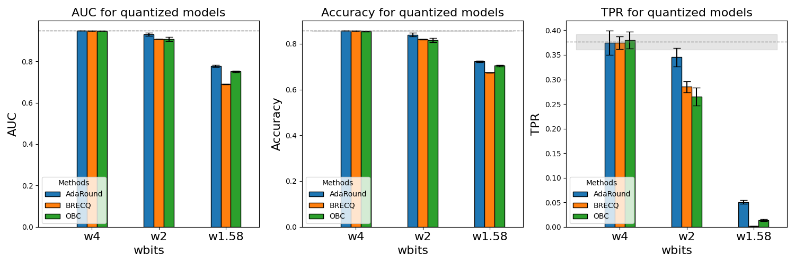

# Quant-MIA


Quant-MIA is a deep learning framework designed for efficient model quantization and Membership Inference Attacks (MIA).
It supports multiple quantization methods, including OBC, BRECQ, and AdaRound, and provides tools for evaluating privacy risks on different datasets under attack scenarios.

## Table of Contents   
- [Usage](#usage)  
- [Project Structure](#project-structure)  
- [Results](#results)  
- [Acknowledgment](#acknowledgment)  
- [License](#license)  

## Usage  

### Quick Start 
```bash
cd Codes/
python main_workflow.py cifar100 path/to/dataset --auto_last_8bit --quant_range 2
```
This command will train a ResNet18 model and 64 shadow models on the selected dataset, then apply asymmetric channel-wise weight 2-bit quantization. Finally, it will perform MIA and save the attack results in `Codes/outdata.txt`.

### Running with Custom Arguments
You can customize the training and quantization process by modifying the `/Codes/config.yaml` file. After making changes, use the `--use_config` argument to load the updated settings. The project will apply all non-null values from the configuration file.

Warning: Be cautious when modifying keys that are set to null, as changing them incorrectly may cause conflicts with `main_workflow.py`. Unless you are very familiar with the code structure, it is not recommended to alter these values.

Example of running with a configuration file: 
```bash
python main_workflow.py cifar100 path/to/dataset --use_config
```
### Making a plot
After you get your results in `Codes/outdata.txt`, you can run the following command to make the plots.
```bash
python analyze.py --file_path outdata.txt
```

## Project Structure  
```markdown
Quant-MIA/Codes  
 ├── AdaRound/           # AdaRound quantization method  
 ├── BRECQ/              # BRECQ quantization method  
 ├── OBC/                # OBC quantization method  
 ├── Utils/              # Dataset preparation, dataloaders, evaluation, and result saving  
 ├── train.py            # Train the full-precision model  
 ├── plot.py             # Apply MIA and save results  
 ├── main_workflow.py    # Main script of the project  
 ├── README.md           # Project documentation  
 └── LICENSE             # License file  
```

## Results  
Below are example results obtained using the quick start command. The results can also be found in `Code/outdata.txt`.

```
Name Full Prec Attack Online
   AUC 0.9460, Accuracy 0.8516, TPR@0.1%FPR of 0.3763
Name Full Prec Attack Online fixed
   AUC 0.9406, Accuracy 0.8425, TPR@0.1%FPR of 0.3355
Name Full Prec Attack Offline
   AUC 0.8087, Accuracy 0.7602, TPR@0.1%FPR of 0.2970
Name Full Prec Attack Offline fixed
   AUC 0.8117, Accuracy 0.7650, TPR@0.1%FPR of 0.2220
Name Full Prec Attack Global threshold
   AUC 0.8139, Accuracy 0.8200, TPR@0.1%FPR of 0.0003
...
```

Example of a plot:



## Acknowledgment
This project includes code from:
- [OBC](https://github.com/IST-DASLab/OBC) 
- [BRECQ](https://github.com/yhhhli/BRECQ)
- [Lira-pytorch](https://github.com/orientino/lira-pytorch)

We have made modifications, including:

- Updating dataset handling functions
- Adding evaluation methods
- Implementing 1.58-bit model quantization

The original license terms apply to these portions of the code.

## License  
This project is licensed under the MIT License. See the [LICENSE](LICENSE) file for details.

